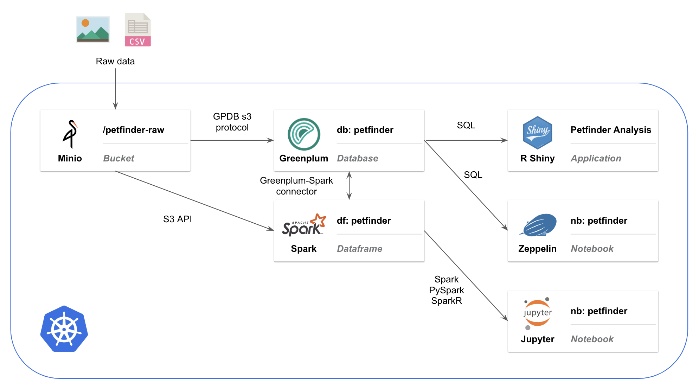

# Data Analytic

## Architecture



## softwares

- [minio-chart-values.yaml](softwares/minio-chart-values.yaml): override default values.yaml of [Minio Helm Chart](https://github.com/helm/charts/tree/master/stable/minio)
- [pivotal-greenplum-instance.yaml](softwares/pivotal-greenplum-instance.yaml): minimum specs of Greenplum cluster used in this demo

## Setup

### 0. Change directory to data-analytic/

```sh
cd data-analytic
```

### 1. Install Minio

Install Minio Helm Chart with overridden [minio-chart-values.yaml](softwares/minio-chart-values.yaml)

```bash
helm install stable/minio --name data-analytic-minio -f ./softwares/minio-chart-values.yaml --version 2.3.0
```

### 2. Install Greenplum

Note: This doc is based on Greenplum on Kubernetes v0.8
Follow:
- [This doc](http://greenplum-kubernetes.docs.pivotal.io/v080/installing.html) to install Greenplum Operator
- [This doc](http://greenplum-kubernetes.docs.pivotal.io/v080/deploy-operator.html) to deploy new Greenplum Cluster

After you have Greenplum on Kubernetes Operator running, do:
```bash
kubectl apply -f ./softwares/pivotal-greenplum-instance.yaml
```

This will create a Greenplum cluster instance `pivotal-greenplum` with 2 segments on Kubernetes

you can check the pods status by:
```bash
kubectl get pods -l greenplum-cluster=pivotal-greenplum
```

### 3. Prepare `minio.conf` for s3 protocol in Greenplum
- Prepare a `minio.conf` according to [Greenplum S3 Protocol doc](https://gpdb.docs.pivotal.io/5150/admin_guide/external/g-s3-protocol.html#amazon-emr__s3_config_file)
- Copy `minio.conf` to all Greenplum Pods under `/home/gpadmin`

Helpful reference: https://github.com/kongc-organization/greenplum-minio

Below is an example `minio.conf` that works with Step 1 and 2 installation
prepare a `minio.conf` and copy it to all `pivotal-greenplum` pods
```bash
cat <<EOF > minio.conf
[default]
secret = "minio12345"
accessid = "minio"
threadnum = 2
chunksize = 671088654
loglevel = DEBUG
encryption = false
version = 2
EOF

for pod in $(kubectl get pods -o go-template --template '{{range .items}}{{.metadata.name}}{{"\n"}}{{end}}' -l greenplum-cluster=pivotal-greenplum);do
    echo "Copying minio.conf to ${pod}:/home/gpadmin/"
    kubectl cp minio.conf ${pod}:/home/gpadmin/
    echo "listing ${pod}"
    kubectl exec -it ${pod} -- ls
done
```

### 4. Create S3 protocol in Greenplum

- Connect to Greenplum use `psql` or whatever tools. 
- run [00-create-s3-protocol.sql](s3-protocol-setup/00-create-s3-protocol.sql) to create s3 protocol in Greenplum


```bash
export GPDB_EXTERNAL_IP=$(kubectl get svc greenplum -o jsonpath="{.status.loadBalancer.ingress[0].ip}")
psql -h ${GPDB_EXTERNAL_IP} -p 5432 -U gpadmin -f s3-protocol-setup/00-create-s3-protocol.sql
```

### 5. Upload data to Minio

- Upload data to Minio on Kubernetes

```bash
kubectl apply -f ./data-load/00-upload-data-to-minio.yaml
```

### 6. Create tables and external tables in Greenplum

- Connect to Greenplum use `psql` or whatever tools. 
- run [01-table-definition.sql](data-load/01-table-definition.sql) to create table definitions in Greenplum

```bash
export GPDB_EXTERNAL_IP=$(kubectl get svc greenplum -o jsonpath="{.status.loadBalancer.ingress[0].ip}")
psql -h ${GPDB_EXTERNAL_IP} -p 5432 -U gpadmin -f data-load/01-table-definition.sql
```

### 7. Load external table into tables in Greenplum

- Connect to Greenplum use `psql` or whatever tools. 
- run [02-load-data-into-gpdb.sql](data-load/02-load-data-into-gpdb.sql) to load data from external tables to tables in Greenplum

```bash
export GPDB_EXTERNAL_IP=$(kubectl get svc greenplum -o jsonpath="{.status.loadBalancer.ingress[0].ip}")
psql -h ${GPDB_EXTERNAL_IP} -p 5432 -U gpadmin -f data-load/02-load-data-into-gpdb.sql
```