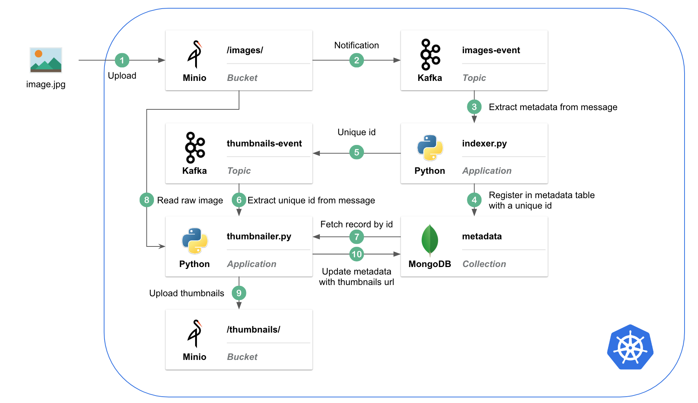

# Event Driven []( https://g.codefresh.io/pipelines/data-on-k8s/builds?repoOwner=qshao-pivotal&repoName=data-on-k8s&serviceName=qshao-pivotal%2Fdata-on-k8s&filter=trigger:build~Build;branch:event-driven;pipeline:5c400cf7b131c12cfe2e69ca~data-on-k8s)

## Architecture



## chart-values

- [minio-chart-values.yaml](chart-values/minio-chart-values.yaml): override default values.yaml of [Minio Helm Chart](https://github.com/helm/charts/tree/master/stable/minio)

- [confluent-chart-values.yaml](chart-values/confluent-chart-values.yaml): override default values.yaml of [Confluent Helm Chart](https://github.com/confluentinc/cp-helm-charts)

- [mongodb-chart-values.yaml](chart-values/mongodb-chart-values.yaml): override default values.yaml of [MongoDB Helm Chart](https://github.com/helm/charts/tree/master/stable/mongodb)

## Setup

### 0. Change directory to event-driven/

```sh
cd event-driven
```

### 1. Install Confluent Kafka

Install Confluent Helm Chart with overridden [confluent-chart-values.yaml](chart-values/confluent-chart-values.yaml)

```sh
helm repo add confluentinc https://confluentinc.github.io/cp-helm-charts/
helm repo update
helm install confluentinc/cp-helm-charts --name event-driven-confluent -f ./chart-values/confluent-chart-values.yaml
```

### 2. Install Minio

Config Minio Notification destination with Kafka info in [minio-chart-values.yaml](chart-values/minio-chart-values.yaml)

```sh
helm install stable/minio --name event-driven-minio -f ./chart-values/minio-chart-values.yaml --version 2.3.0
```

### 3. Install MongoDB

Install MongoDB with overridden [mongo-chart-values.yaml](chart-values/mongodb-chart-values.yaml)

```sh
helm install stable/mongodb --name event-driven-mongodb -f ./chart-values/mongodb-chart-values.yaml
```

### 4. Create Minio buckets, bucket event notifications and Kafka topics

```sh
kubectl apply -f ./setup.yaml
```

This Kubernetes Job contains:

- Create `images-bucket-event` topic in Kafka
- Create `thumbnails-event` topic in Kafka
- Create `images` and `thumbnails` buckets in Minio
- Create event notification for `images` bucket to publish `put` event to `images-bucjet-event` topic in Kafka

### 5. Deploy indexer application

Indexer does:

- Consume notification message from `images-bucket-event` topic
- Extract useful record from message and insert into MongoDB
- Send the unique ObjectID of the record to `thumbnails-event` topic

```sh
kubectl apply -f ./indexer/indexer.yaml
```

### 6. Deploy thumbnailer application

thumbnailer does:

- Consume message from `thumbnails-event` topic
- Extract ObjectID from message and query metadata in MongoDB to get image url 
- Read the original image and create a thumbnail for it
- Upload the thumbnail to `thumbnails` bucket
- Update metadata in MongoDB with thumbnail url

```sh
kubectl apply -f ./thumbnailer/thumbnailer.yaml
```